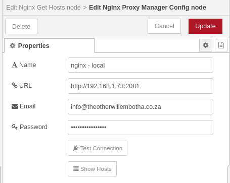
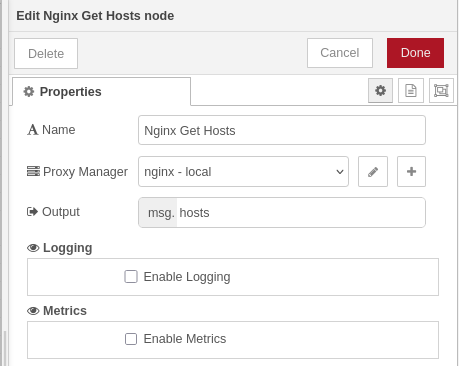

# @theotherwillembotha/node-red-nginxproxymanager

Node-RED nodes for managing [Nginx Proxy Manager](https://nginxproxymanager.com/) hosts directly from your flows. Built on [@theotherwillembotha/node-red-plugincore](https://github.com/theotherwillembotha/nodered_plugincore).

---

## Installation

Either use the **Manage Palette** option in the Node-RED editor, or run the following in your Node-RED user directory (typically `~/.node-red`):

```bash
npm install @theotherwillembotha/node-red-nginxproxymanager
```

---

## Nodes

### Nginx Proxy Manager Config

A config node that holds the connection details for an Nginx Proxy Manager instance. Referenced by all other nodes in this plugin.



| Field    | Description |
|----------|-------------|
| Name     | A descriptive label for this connection. |
| URL      | The base URL of the Nginx Proxy Manager admin API, including port (e.g. `http://192.168.1.10:81`). |
| Email    | The email address used to authenticate with Nginx Proxy Manager. |
| Password | The password for the above account. |

> This config node registers itself as a `ReverseProxyType` in the plugincore tag system. This means it will automatically appear in the reverse proxy selector of any webhook node that uses the `WebhookTemplate` from `node-red-plugincore`.

---

### Nginx Update Host

Creates or updates a proxy host entry in Nginx Proxy Manager. The operation is determined by the presence of an `id` field in `msg.payload`:

- **No `id`** — creates a new proxy host.
- **With `id`** — updates the existing proxy host with that ID.

#### Inputs

: *msg.payload* (object) : The host configuration to create or update. See the payload schema below.

#### Outputs

: *msg* (object) : The original message, passed through unchanged after the operation completes.

#### Payload schema

**Create a new host** — all required fields must be present:

```javascript
{
    domainNames: string[],        // The domain names to forward (each must be unique and not yet registered).
    scheme: "http" | "https",     // The forwarding scheme.
    forwardHost: string,          // The target host to forward requests to.
    forwardPort: number,          // The target port to forward requests to.
    accessList: string,           // The access list to bind to this host.
    cacheAssets: boolean,         // Optional: whether to cache assets.
    blockCommonExploits: boolean, // Optional: whether to block common exploits.
    websocketSupport: boolean,    // Optional: whether to enable WebSocket support.
}
```

**Update an existing host** — only include fields that should change:

```javascript
{
    id: number,                   // Required: the ID of the proxy host to update.
    domainNames: string[],        // Optional.
    scheme: "http" | "https",     // Optional.
    forwardHost: string,          // Optional.
    forwardPort: number,          // Optional.
    accessList: string,           // Optional.
    cacheAssets: boolean,         // Optional.
    blockCommonExploits: boolean, // Optional.
    websocketSupport: boolean,    // Optional.
}
```

#### Example

```json
{
    "domainNames": ["myservice.example.com"],
    "scheme": "http",
    "forwardHost": "192.168.1.35",
    "forwardPort": 8080,
    "blockCommonExploits": true,
    "websocketSupport": true
}
```

---

### Nginx Get Hosts

Retrieves the full list of proxy hosts from Nginx Proxy Manager and writes them to a configurable property on the message.



#### Properties

| Field         | Description |
|---------------|-------------|
| Name          | A descriptive label for the node. |
| Proxy Manager | The Nginx Proxy Manager config node to use. |
| Output        | The message property to write the hosts array to. Defaults to `msg.payload`. |

#### Inputs

: *msg* (object) : Any message. The payload is not used; the output property is set on the incoming message and forwarded.

#### Outputs

: *msg* (object) : The original message with the specified output property set to an array of proxy host objects.

#### Output schema

```javascript
[
    {
        id:          number,    // proxy host ID
        domainNames: string[],  // domain names served by this host
        scheme:      string,    // forwarding scheme: "http" or "https"
        forwardHost: string,    // target host
        forwardPort: number,    // target port
    }
]
```

---

## Integration with node-red-plugincore

This plugin is built on [@theotherwillembotha/node-red-plugincore](https://github.com/theotherwillembotha/nodered_plugincore) and integrates with its subsystems:

- **Logging** — all action nodes (Nginx Update Host, Nginx Get Hosts) accept a logger config node via the `LoggerTemplate` section in their editors, enabling structured log output to Console, REST, or Loki backends.
- **Metrics** — all action nodes track request counts via the `MetricsTemplate` section, publishing Prometheus counters that can be scraped from the metrics endpoint.
- **Reverse Proxy** — the Nginx Proxy Manager Config node registers itself as a `ReverseProxyType`. Any webhook node using `WebhookTemplate` will automatically list this config node in its reverse proxy selector, allowing Node-RED webhooks to be registered directly in Nginx Proxy Manager via a flow.

---

## References

- [Nginx Proxy Manager — Project](https://nginxproxymanager.com/)
- [Nginx Proxy Manager — GitHub](https://github.com/NginxProxyManager/nginx-proxy-manager)
- [node-red-plugincore](https://github.com/theotherwillembotha/nodered_plugincore)
- [node-red-telemetry](https://github.com/theotherwillembotha/nodered_telemetry)

## License

[ISC](LICENSE)
